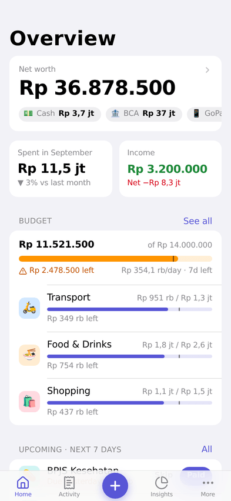
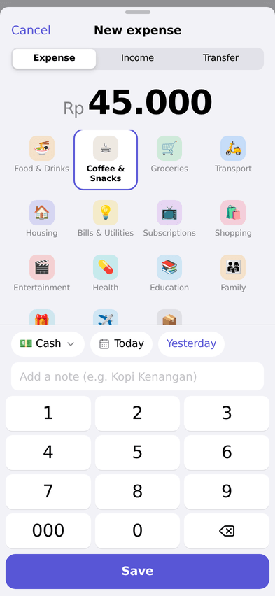
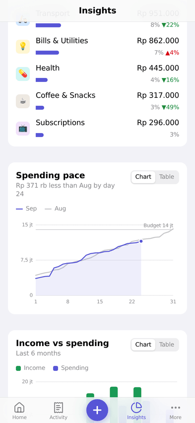
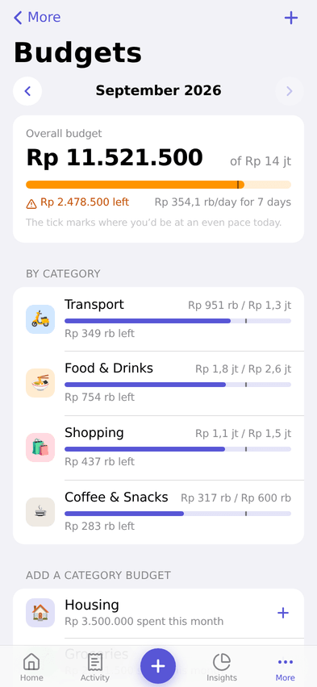
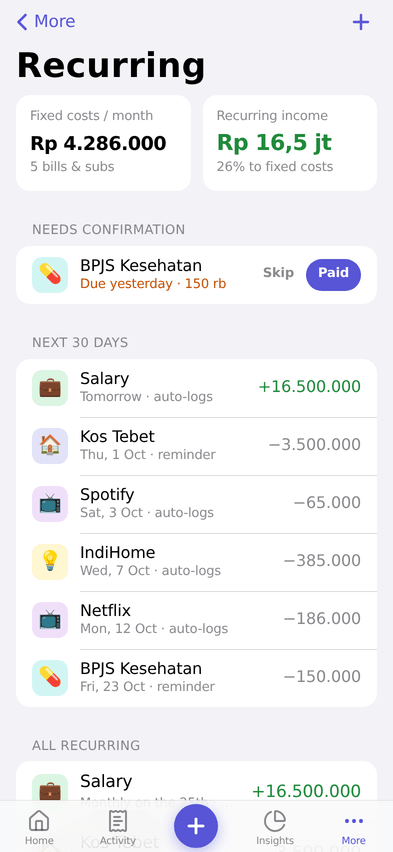
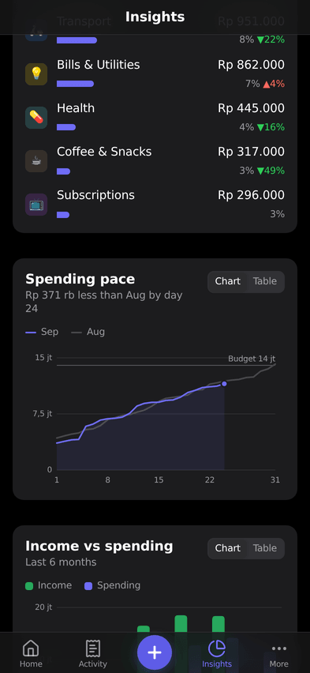
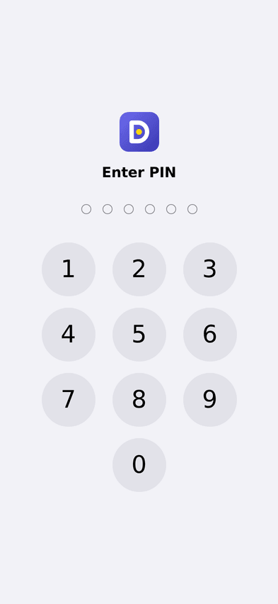
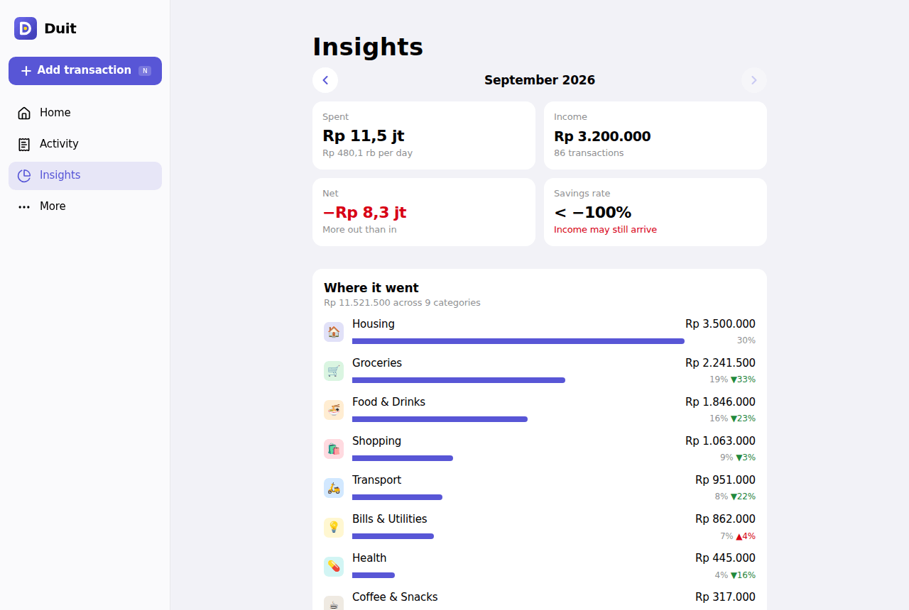

<div align="center">


# Duit

**Know where every rupiah goes.**
An offline-first personal money tracker built for iPhone (as a Home Screen app) and the web.

**Live:** [moneytracker-ten-phi.vercel.app](https://moneytracker-ten-phi.vercel.app)
**Retro prototype (try on your phone):** [duit-os-prototype.vercel.app](https://duit-os-prototype.vercel.app), source in [`design/prototype`](design/prototype)

</div>

<p align="center">
  
  
  
  
</p>

## Features

| | |
|---|---|
| **3-second entry** | Custom keypad with a `000` key, one tap per category, and "Yesterday" in one tap. It remembers your last account. |
| **Accounts & transfers** | Cash, bank, e-wallet (GoPay/OVO/…), credit card, and savings. Tracks net worth, assets, and debts. |
| **Monthly budgets** | Overall and per category, with a pace marker, "Rp X/day left", and 80%/100% warnings (icon + text, never color alone). |
| **Insights** | Where it went (ranked by category, with change vs last month), spending pace vs last month, 6-month income vs spending, and savings rate. Every chart has a table view. |
| **Recurring & subscriptions** | Auto-log salary and Netflix, or get reminders for bills that vary ("Paid" / "Skip"). Shows fixed costs per month. |
| **Offline-first sync** | Saves instantly to the device and syncs through *your own* Supabase project. Merges by last write wins, and deletes sync too. |
| **App lock** | Face ID (device passkey via WebAuthn) with a 6-digit PIN fallback. Auto-locks after a delay you choose. |
| **iOS-native feel** | Large collapsing titles, grouped lists, bottom sheets, safe areas, haptics, light/dark mode, and launch screens. |
| **Your data, portable** | CSV export, full JSON backup and restore, and erase this device. |

## Install on your iPhone

1. Open the deployed URL in **Safari**.
2. Tap **Share** → **Add to Home Screen**.
3. Open **Duit** from the Home Screen. It runs full-screen and works offline.
4. Optional: **More → App lock** to turn on Face ID.

> Home Screen web apps are exempt from Safari's 7-day storage cleanup, and Duit also requests persistent storage. For extra safety, turn on sync or export a backup now and then.

## Cloud sync (Supabase)

Duit works fully without an account. To use the same data on your iPhone and laptop, and to keep a cloud backup, connect a free Supabase project. It takes about 5 minutes:

1. Create a project at [supabase.com](https://supabase.com) (the free tier is plenty).
2. **SQL Editor → New query** → paste [`supabase/schema.sql`](supabase/schema.sql) → **Run**.
3. **Project Settings → API**: copy the **Project URL** and the **publishable/anon key**.
4. Either:
   - **In the app:** More → Sync & backup → paste both → Connect. Repeat on each device. Or
   - **At build time:** set `VITE_SUPABASE_URL` and `VITE_SUPABASE_ANON_KEY` in Vercel (see [`.env.example`](.env.example)) so every device is preconfigured.
5. Create your account in the app (email + password) and sign in on your other devices.

> **Tip:** For a single-user app you can turn off **Authentication → Providers → Email → Confirm email** so sign-up works immediately. Email + password is used instead of magic links because iOS opens links in Safari, whose storage is separate from the Home Screen app.

**How it works:** each record is one row in a `records` table (a JSON payload) protected by row-level security. Pushes go through a `push_records` RPC with a server-side *last-write-wins* guard, so a phone that was offline can never overwrite newer edits. Pulls use a server-assigned timestamp cursor, so device clock skew doesn't matter. Default categories and recurring occurrences use deterministic IDs, so two devices never create duplicates.

## Development

```bash
npm install
npm run dev        # http://localhost:5173
npm test           # unit + sync-engine tests (Vitest, fake IndexedDB, fake Supabase)
npm run typecheck
npm run build      # production build + service worker
```

In dev mode, run `await __duitDemo.seedDemo()` in the browser console to load three months of realistic demo data.

### Tech

React 19 · TypeScript · Vite · Tailwind CSS v4 · Dexie (IndexedDB) · Supabase · Workbox (vite-plugin-pwa) · Lucide icons. Charts are hand-rolled SVG with no chart library.

```
src/
├── db/          Dexie schema, typed repository (all writes stamp updatedAt + dirty), seed data
├── domain/      pure logic: balances, budgets, recurring schedules, insights, backup (unit-tested)
├── sync/        Supabase client (lazy-loaded), LWW merge, push/pull engine + scheduler
├── security/    WebAuthn Face ID + PBKDF2 PIN, lock screen
├── components/  UI kit (Page, List, Sheet, Keypad, Meter, StatTile…) and charts
├── features/    composer, transaction list, budget/recurring/account/category sheets
└── pages/       screens
```

Product decisions, scope, and roadmap are in the [PRD](docs/PRD.md).

## Deploy

The repo includes a `vercel.json` (Vite preset, SPA rewrites, and service-worker cache headers). Import the repo in Vercel, or run `vercel --prod`. HTTPS is required for the service worker and Face ID, and Vercel provides it by default.

## Privacy & security

- Data lives in IndexedDB on your device. It syncs only to the Supabase project **you** configure, isolated per user by row-level security.
- The Supabase publishable (anon) key is designed to be public, and RLS enforces access.
- The app lock is a privacy screen, not encryption. Data at rest relies on iOS device encryption (on whenever your iPhone has a passcode). The PIN is stored only as a salted PBKDF2-SHA256 hash, with escalating cooldowns after failed attempts.

<p align="center">
  
  
  
</p>
<p align="center"></p>
