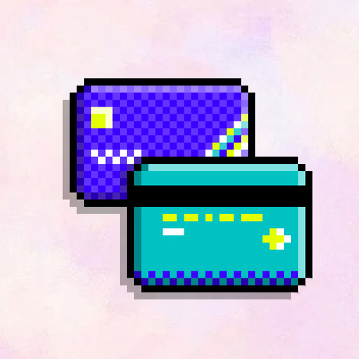
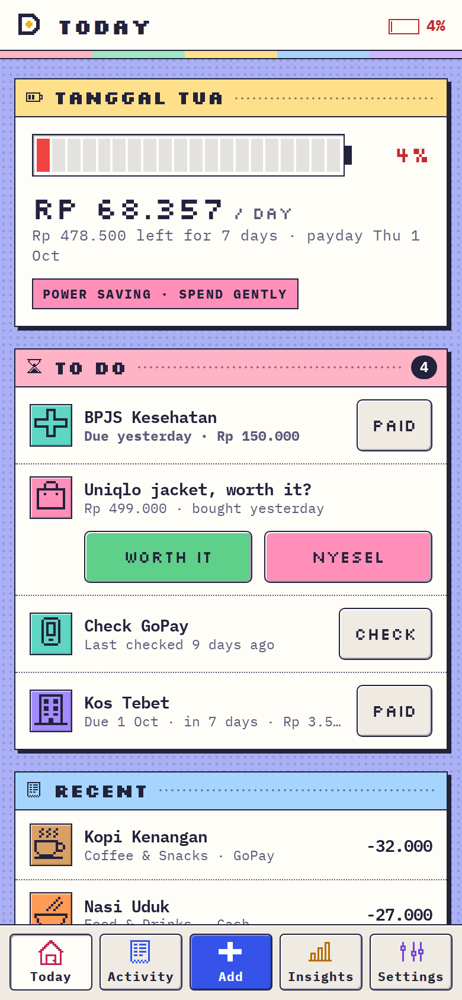
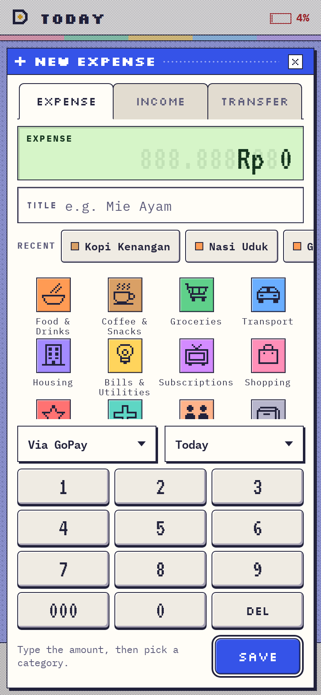
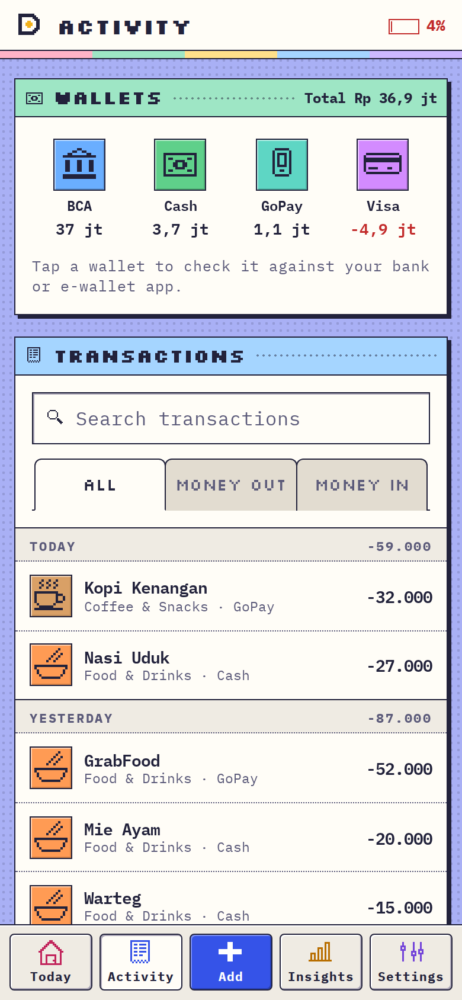
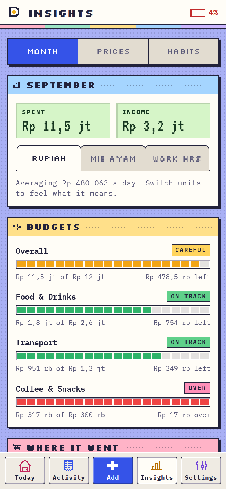
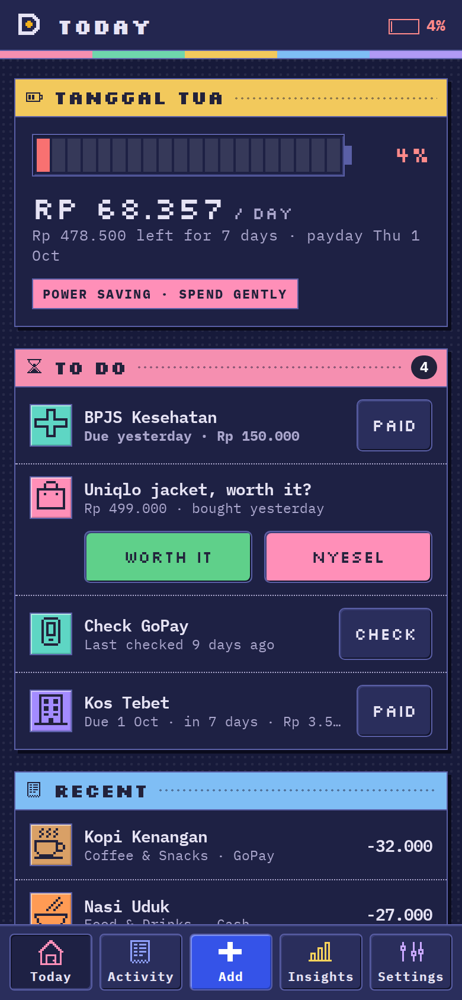
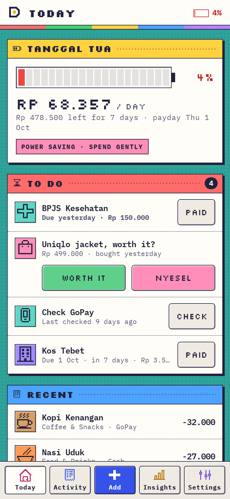
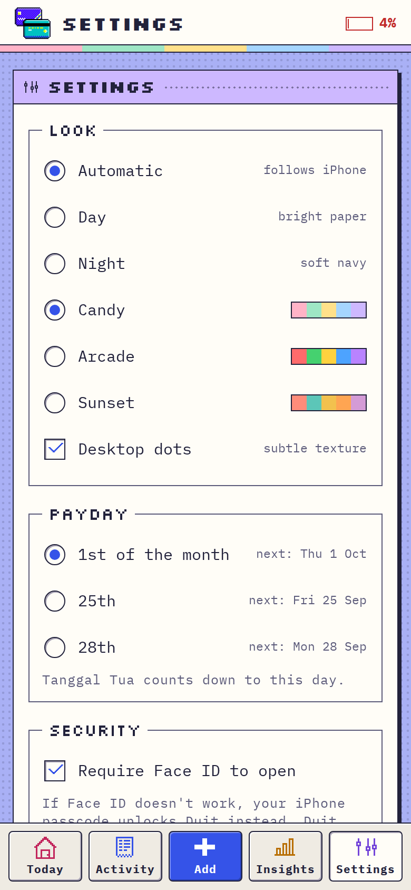

<div align="center">



# Duit

**Know where every rupiah goes.**
A personal money tracker for iPhone, dressed up as a tiny retro desktop OS.
Native SwiftUI, local-first, no account.

**Try the retro prototype in your browser:** [duit-os-prototype.vercel.app](https://duit-os-prototype.vercel.app), source in [`design/prototype`](design/prototype)

</div>

<p align="center">
  
  
  
  
</p>
<p align="center">
  
  
  
</p>
<p align="center"><sub>Rendered from the Duit OS prototype with the app's bundled fonts, using sample data. The native app follows this design; the prototype's "Demo: jump to payday" link is demo-only.</sub></p>

## What it is

Duit tracks your money in rupiah with the smallest amount of ceremony. Every window has a pixel-art title bar, amounts show on a green LCD, and the home screen is a battery that drains as payday gets closer (*tanggal tua*, the lean days at the end of the month). Everything stays on your iPhone. There is no sign-up and no server.

The **native iOS app in [`ios/`](ios)** is the product. The original React web app is kept as a reference (see [Legacy web app](#legacy-web-app)).

## Features

| | |
|---|---|
| **Today** | The *Tanggal Tua* battery shows how much you can still spend per day until payday. The **Duit Terminal** takes entries in plain slang (`mie ayam 22rb`) and answers questions (`sisa?`, `grab vs gojek`). **To do** lists bills to mark Paid or Skip, purchases to rate "worth it?", and wallets due for a balance check. |
| **Fast entry** | Expense, Income and Transfer. A green LCD amount, a keypad with a `000` key, one tap per category, recent-title suggestions, and an Undo toast after saving. |
| **Wallets** | Cash, bank, e-wallet, credit card and savings, each with a live balance. **Balance Check** compares a wallet with your bank or e-wallet app and helps you find the gap. |
| **Activity** | Transactions grouped by day, with search and All / Money out / Money in filters. Tap a transaction to edit it. |
| **Insights** | **Month:** spent vs income, budgets with a pace meter, where it went, and six months of trend, shown in rupiah, *mie ayam* or work hours. **Prices:** how the price of what you buy changes. **Habits:** the Habit Time Machine finds what you keep buying, shows what it costs a year, and projects what you'd save by buying it less often. |
| **Payday Split** | A boot screen on payday, then give your salary a job: rent, savings, family, bills. The leftover becomes next month's spending money. |
| **Budgets & bills** | An overall budget, per-category budgets, and recurring bills and subscriptions with Paid / Skip. |
| **Look** | Automatic, Day or Night, three palettes (Candy, Arcade, Sunset), optional desktop dots. Text and background pairs meet WCAG AA contrast in both modes, and type scales with Dynamic Type. |
| **Private by design** | Optional Face ID lock with your iPhone passcode as the backup. No account, no analytics, no network requests. |
| **Your data, portable** | Export every transaction as CSV, or erase everything from Settings. |

Setup lives in **Settings**: spending money, monthly salary, wallets, category budgets, bills and Payday Split buckets.

## Status

The native app covers the whole retro prototype. It builds, and its unit tests (all the money, budget, payday and slang-parsing rules) pass in CI whenever the native code changes. It is not on the App Store yet.

Not built yet: iCloud sync (the **Connect…** button says so), JSON backup and restore, editing categories (the 22 defaults are fixed), widgets, notifications, and first-run onboarding. The roadmap, decisions and known gaps are in [`docs/IOS_NATIVE_PLAN.md`](docs/IOS_NATIVE_PLAN.md).

## Install on your iPhone

Requires **iOS 17 or later**.

### Option 1: Unsigned IPA (no Mac needed)

1. Download `Duit-v0.2.0-unsigned.ipa` from the [v0.2.0 pre-release](https://github.com/samidun26/moneytracker/releases/tag/v0.2.0), the first build with the full retro app. Newer builds appear on the [Releases](https://github.com/samidun26/moneytracker/releases) page, and every CI run uploads a `Duit-unsigned-ipa` artifact on the [Actions](https://github.com/samidun26/moneytracker/actions/workflows/ios.yml) tab (kept for 14 days).
2. iOS only runs signed apps, so re-sign it with [Sideloadly](https://sideloadly.io) or [AltStore](https://altstore.io) and a free Apple ID.
3. Free Apple IDs expire the app after **7 days** and allow 3 sideloaded apps, so you need to refresh it from a computer.

### Option 2: Build from source (Mac)

```bash
brew install xcodegen
cd ios
xcodegen generate     # writes Duit.xcodeproj (gitignored)
open Duit.xcodeproj
```

In Xcode, choose the **Duit** target, pick your Team under **Signing & Capabilities**, select your iPhone and press Run. If Xcode can't register `com.samidun26.duit` (a placeholder), change `PRODUCT_BUNDLE_IDENTIFIER` in [`ios/project.yml`](ios/project.yml). Run the tests with **Product → Test** (⌘U).

Your data stays on the phone between builds as long as the bundle ID doesn't change. Running `xcodegen generate` again resets Xcode's signing, so pick your Team again.

## Under the hood

Swift · SwiftUI · SwiftData · XcodeGen · GitHub Actions (macOS runners). No third-party packages, no backend. Charts are drawn in SwiftUI. Fonts are bundled and open source (SIL OFL): Silkscreen, VT323 and IBM Plex Mono.

```
ios/
├── Duit/
│   ├── App/          entry point, shell, lock, one Ledger snapshot the screens read
│   ├── Features/     Today, Transactions, Insights, Payday, Wallets, Settings
│   ├── Components/   the retro kit: windows, bevel buttons, keypad, pixel icons, stamps
│   ├── Models/       SwiftData models (Transaction, Account, Budget, RecurringRule…)
│   ├── Services/     pure, unit-tested rules: balances, budgets, pay cycle, slang parser…
│   └── Resources/    theme tokens, bundled fonts, generated pixel-icon data
├── DuitTests/        unit tests for the services
└── project.yml       XcodeGen spec
design/prototype/     the interactive retro prototype (HTML), the visual and UX spec
```

Amounts are integer rupiah, so there are no rounding bugs. The calculation rules are ports of the web app's tested domain code (`src/domain`), and the prototype's own sample numbers are used as test expectations.

## Privacy & security

- Your data lives in a SwiftData store on your iPhone. The app has no server, no account and no analytics, and never makes a network request.
- **Export CSV** only shares a file when you ask for it.
- The lock is a privacy screen, not extra encryption. It uses Face ID with your iPhone passcode as the fallback, and locks as soon as the app goes to the background. Data at rest relies on iOS device encryption, which is on whenever your iPhone has a passcode.

## Legacy web app

The first version of Duit was a React PWA. It is now a **reference implementation**: the UI/UX spec and the tested spec for the calculation rules the native app ports. It stays deployed and works on its own, but gets no new product features.

**Live:** [moneytracker-ten-phi.vercel.app](https://moneytracker-ten-phi.vercel.app) · Product notes: [`docs/PRD.md`](docs/PRD.md)

```bash
npm install
npm run dev        # http://localhost:5173
npm test           # unit + sync-engine tests (Vitest, fake IndexedDB, fake Supabase)
npm run typecheck
npm run build      # production build + service worker
```

React 19 · TypeScript · Vite · Tailwind CSS v4 · Dexie (IndexedDB) · Supabase · Workbox. In dev mode, run `await __duitDemo.seedDemo()` in the browser console to load three months of demo data. The repo includes a `vercel.json` for deploying it.

<details>
<summary>Web app: optional cloud sync with Supabase</summary>

The web app works fully without an account. To share data between devices and keep a cloud backup, connect a free Supabase project (about 5 minutes):

1. Create a project at [supabase.com](https://supabase.com).
2. **SQL Editor → New query** → paste [`supabase/schema.sql`](supabase/schema.sql) → **Run**.
3. **Project Settings → API**: copy the **Project URL** and the **publishable/anon key**.
4. Either paste both in the app (**More → Sync & backup → Connect**), or set `VITE_SUPABASE_URL` and `VITE_SUPABASE_ANON_KEY` in Vercel (see [`.env.example`](.env.example)).
5. Create your account in the app (email + password) and sign in on your other devices.

Each record is one row in a `records` table (a JSON payload) protected by row-level security. Pushes go through a `push_records` RPC with a server-side last-write-wins guard, and pulls use a server-assigned timestamp cursor, so device clock skew doesn't matter. The native app does not use Supabase.

</details>

## Docs

- [`docs/IOS_NATIVE_PLAN.md`](docs/IOS_NATIVE_PLAN.md): native app roadmap, decisions and status
- [`docs/APP_STORE_PLAN.md`](docs/APP_STORE_PLAN.md): Apple Developer Program, TestFlight and App Store checklist
- [`CLAUDE.md`](CLAUDE.md): project rules and architecture principles
